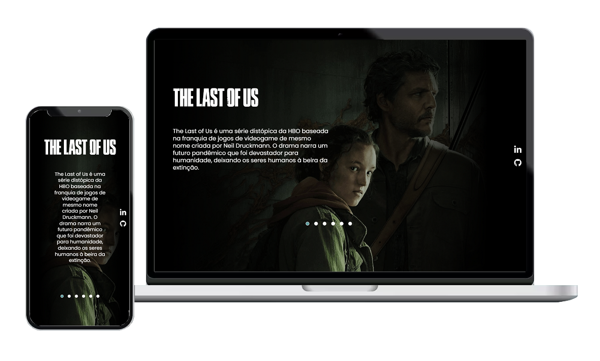

## Sobre The Lest Of Us

O template The Last of Us foi elaborado através de um evento online de tecnologia fornecido para equipe Dev em Dobro. 

Neste evento, foi possível praticar as linguagens de programação e elaborar um template da série HBO, The Last of Uf, com HTML, CSS e JavaScript codificados do zero.

## Tecnologias utilizadas

O projeto foi codificado do zero com HTML, CSS e JavaScript.

- **HTML**
- **CSS**
- **JavaScript**

## Licença

O projeto contém a licença MIT